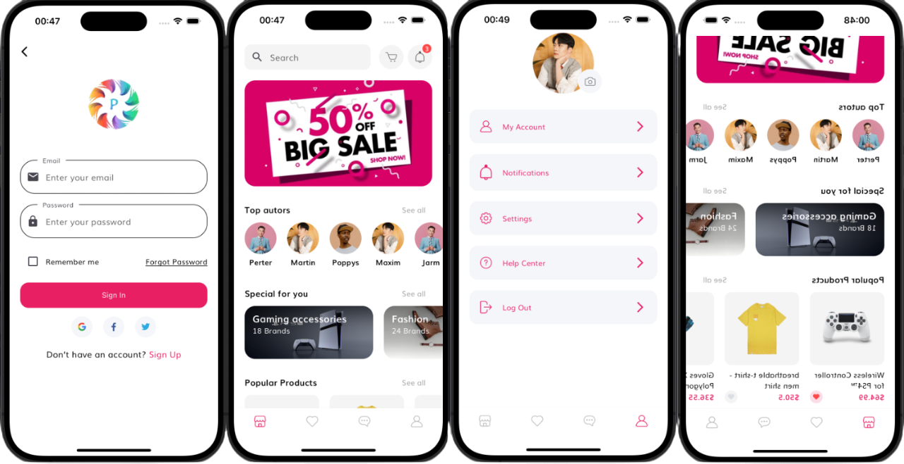

# 🛒 E-Commerce Shop App (Flutter UI)

A modern **E-Commerce mobile app UI** built with **Flutter**, featuring clean design, smooth navigation, and responsive layouts for a seamless shopping experience.

---

## 📌 Features

- **Authentication**: Login & Sign Up
- **User Profile**: Complete Profile page
- **Shopping Flow**: Home Page, Product Details, Order page
- **Navigation**: Bottom Navigation Bar
- **Extra**: Profile management

---

## 📷 Screenshots

| Demo |
|-------|
|  |
---

## 🛠️ Technologies Used

- [Flutter](https://flutter.dev/) — Cross-platform UI toolkit
- [Dart](https://dart.dev/) — Programming language for Flutter

---

## 🚀 Getting Started

Follow these steps to set up and run the app on your local machine:

### 1️⃣ Prerequisites
Make sure you have installed:
- [Flutter SDK](https://docs.flutter.dev/get-started/install)
- [Dart SDK](https://dart.dev/get-dart) (usually included with Flutter)
- An emulator or physical device for testing

Verify your setup:
```bash
flutter doctor

---

# Clone the repository
git clone https://github.com/yourusername/e-commerce-shop-flutter-ui.git

# Navigate to the project directory
cd e-commerce-shop-flutter-ui

# Install dependencies
flutter pub get

# Run the app
flutter run

